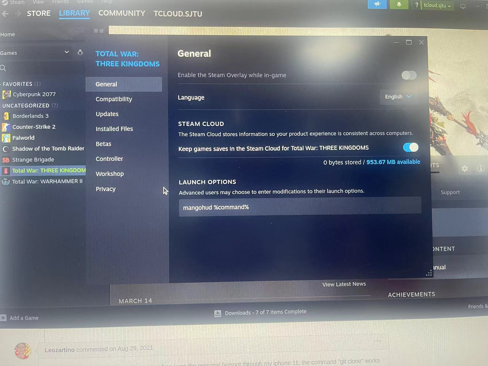
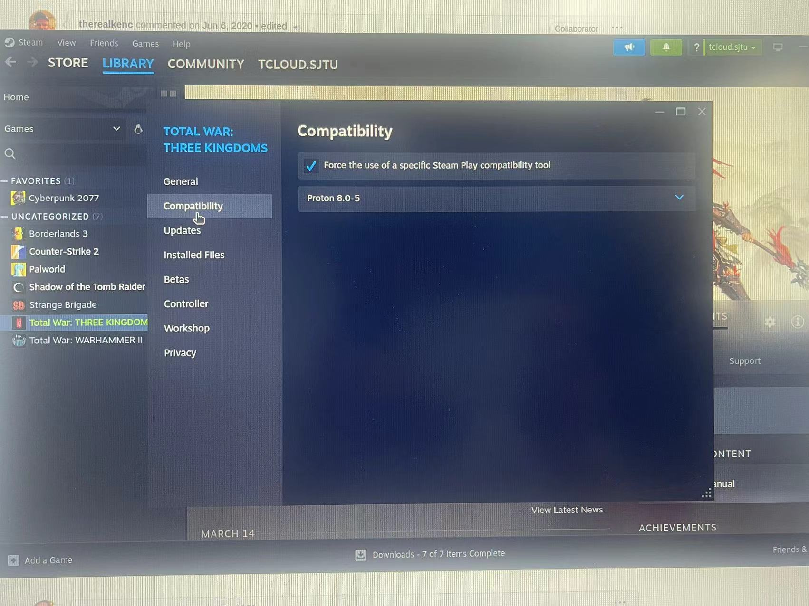
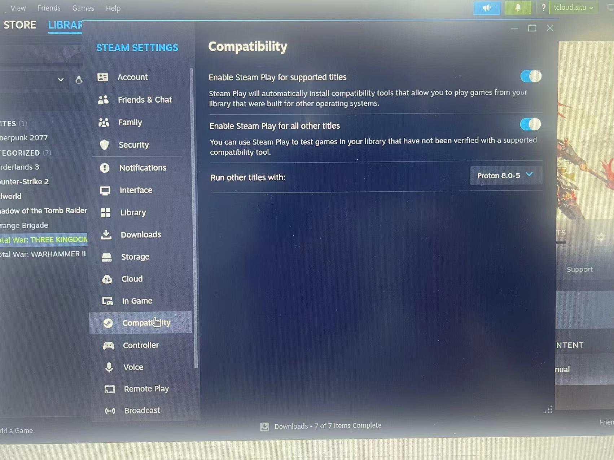
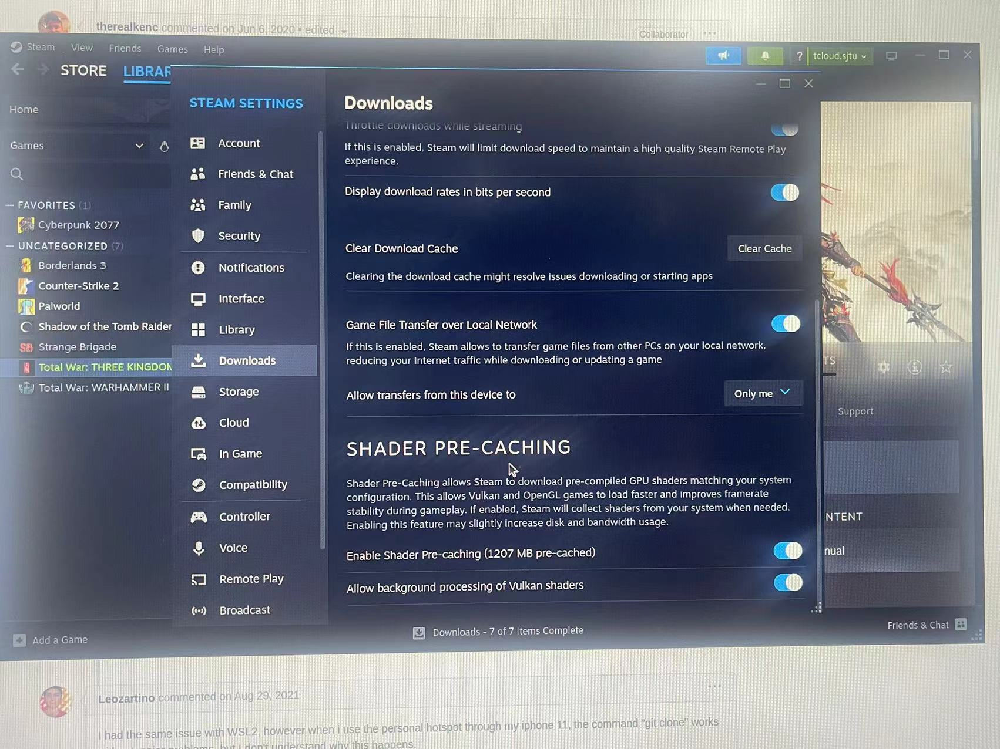
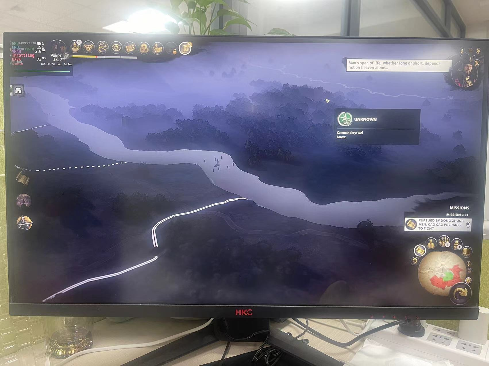
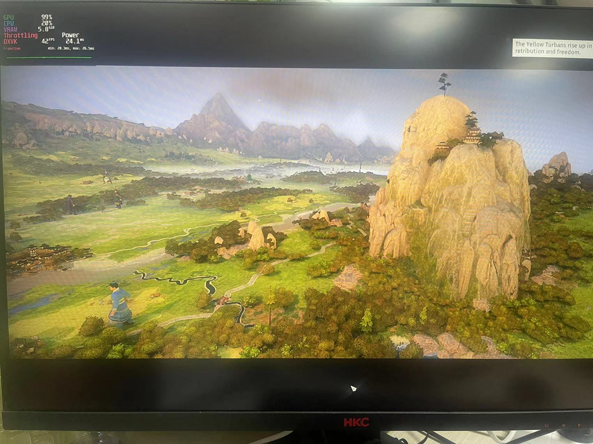
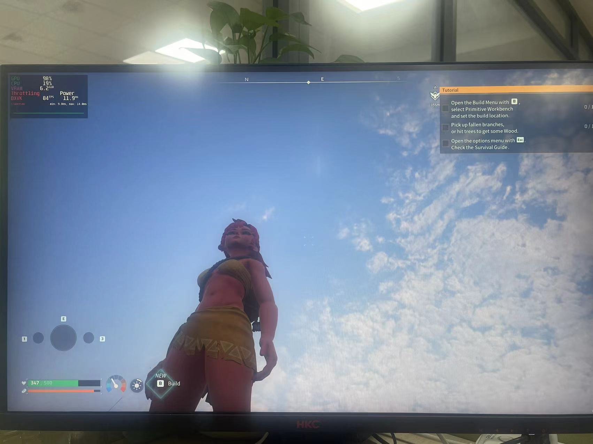
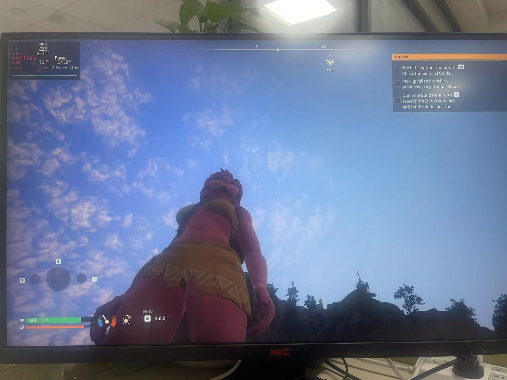

# Week Four: Understanding Partial Evaluation Through Example   

## Task
**Running x86 Windows Games on Linux**

- **DirectX**
  - A suite of APIs for graphics, sound, etc.
  - Direct3D (part of DirectX) manages 3D graphics rendering.
  - Native to Windows, not directly compatible with Linux.

- **Vulkan**
  - Cross-platform graphics API.
  - Handles 3D graphics similarly to Direct3D but with a different approach.
  - Supported on Linux, Windows, and other platforms.

- **Wine/Proton**
  - Compatibility layers to run Windows apps on Linux.
  - Translate Windows system calls to Linux equivalents.
  - Can handle x86 architecture translation for non-x86 Linux systems.

- **DXVK (DirectX to Vulkan)**
  - Translates Direct3D 10/11 calls into Vulkan calls.
  - Works with Wine/Proton to enable graphics rendering.
  - Essential for games that rely on DirectX for 3D graphics.

- **Fossilize**
    - Fossilize is a serialization format and a toolset for capturing and replaying graphics API state, primarily designed for Vulkan.
    - It is used to capture the state of graphics applications (like games) to help in testing and optimizing graphics drivers.
    - The tool can be integrated into driver development workflows to ensure that driver updates do not break compatibility with existing applications.
    - Fossilize has been utilized in the Vulkan ecosystem to improve driver stability and performance through regression testing.

**Process Overview**

1. **Emulation/Translation Layer**: Wine or Proton runs the game, handling system call translation and potentially CPU architecture translation.

2. **Graphics API Translation**: DXVK takes DirectX graphics calls from the game and translates them into Vulkan calls, which Linux can execute.

3. **Rendering**: Vulkan processes the translated calls, rendering the game's graphics on the Linux system.

4. **Optimization and Testing with Fossilize**: Fossilize captures the state of graphics applications running through Vulkan, allowing developers and testers to replay specific scenarios for testing and optimization. This helps in identifying and fixing driver issues, ensuring better performance and compatibility.

## Installing/Setting up Mangohud
Reference Video: https://www.youtube.com/watch?v=m-PHWxkdra8&t=195s&ab_channel=IntelligentGaming

Find `.tar.gz` file in https://github.com/flightlessmango/MangoHud/releases and install  
```
sudo apt install mangohud
./mangohud-setup.sh install
```

## Installing/Setting up Fossilize
https://github.com/ValveSoftware/Fossilize
Setting up `Fossilize`
```
git clone https://github.com/ValveSoftware/Fossilize.git
git submodule update --init
mkdir build
cd build
cmake ..
cmake --build .
```
Finish setting `Fossilize` for use with 
```
export VK_ADD_LAYER_PATH=$(pwd)/layer
echo $VK_ADD_LAYER_PATH
```

## Installing/Setting up Steam
```
sudo apt update
sudo apt upgrade
sudo apt install steam
```
Login to `steam` through lab account
username: tcloud5406
password: Tcloud@5406

Next, configure Steam for both `Mangohud`, `Dxvk` compatability, and `Fossilize`
### Mangohud
Paste `mangohud %command%` under the launch options to enable mangohud


### Dxvk compatability
Enable compatability tool (recommended to change to `Proton 8.0-5` or any other stable versions)

Might have to manually force compability of certain games


### Fossilize
Steam has a built-in fossilize option, check both of the shading pre-cache options


## Testing Games

### Total War: THREE KINGDOMS
`With Fossilize`


`Without Fossilize`


### Palworld
`With Fossilize`


`Without Fossilize`


## Exporting Fossilize Data   


## Proxy
tcloud.sjtu.edu.cn/guide
